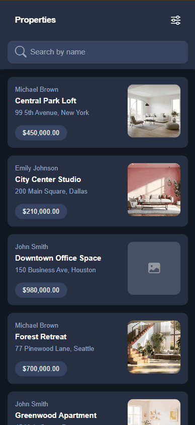

# RealEstateTest

Proyecto de prueba técnica que incluye:

- Backend `RealEstateApi/`: API .NET 9 con ABP Framework y arquitectura modular.

- Frontend `RealEstateUI/`: React + Vite con arquitectura Feature-Sliced Design (FSD).

## Arquitectura

### Backend (ABP Modular)

- Arquitectura: ABP Modular, los siguientes enlaces son alguno de los recursos que sirvieron como guía de este proyecto:

	- [Creación de aplicaciones modulares con ASP.NET Core y ABP](https://www.youtube.com/watch?v=Bn7ybLRfQdg&t=1452s)
	- [Modular Monolith Application ](https://abp.io/docs/latest/tutorials/modular-crm)

- Base de datos: MongoDB (`mongodb://localhost:27017/RealEstateDb`).

- URL/puerto por defecto: `https://localhost:44314`.

- Módulos: Los módulos se encuentran en el directorio `RealEstateApi/modules` y consiste de:

| Módulo                      |Descripción                        |Colecciones                            |
|-----------------------------|-----------------------------------|---------------------------------------|
|`realestate.ownering`        |Módulo de propietarios             |Owner                                  |
|`realestate.propertycatalog` |Módulo del catálogo de propiedades |Property, PropertyImage & PropertyTrace|


### Frontend (React)

- Arquitectura: Feature-Sliced Design (FSC)

- Stack: React 19, Vite, React Query, Axios, Vitest + Testing Library.

- URL/puerto por defecto: `http://localhost:3000`.

## Arranque local

### Requisitos

- .NET SDK 9.0+

- Node >= 18 (pnpm o npm)

---

### Backend (requiere MongoDB local):

```bash
# Navegar a RealEstateApi/
cd ./RealEstateApi
# Ejecutar migraciones
dotnet run --migrate-database --project RealEstateApi
# Levantar el proyecto
dotnet run --project RealEstateApi
# Swagger: https://localhost:44314/swagger
```

### Backups
Para poblar la base de datos con datos de prueba, importar los archivos JSON ubicados en `./backups` a las respectivas colecciones de MongoDB.


### Frontend:

```bash
# Navegar a RealEstateUI/
cd ./RealEstateUI
# Instalar depedencias
pnpm install
# Levantar el proyecto
pnpm dev
# http://localhost:3000
```

## Pruebas Unitarias

### Backend (por módulo):

```bash
# PropertyCatalog
cd ./modules/realestate.propertycatalog
dotnet test

# Ownering
cd ./modules/realestate.ownering
dotnet test
```

### Frontend:

```bash
cd ./RealEstateUI
pnpm test
```

## ScreenGif



