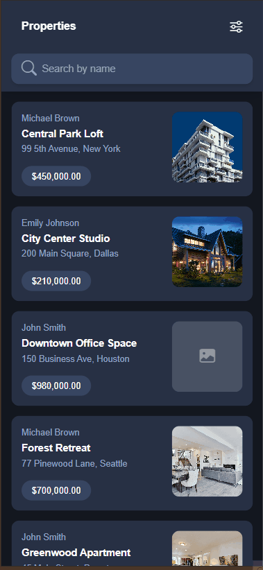

## RealEstateTest

Technical test project including:

- Backend `RealEstateApi/`: .NET 9 API with ABP Framework and modular architecture.

- Frontend `RealEstateUI/`: React + Vite with Feature-Sliced Design (FSD).

## Architecture

### Backend (ABP Modular)

- Architecture: ABP Modular. The following resources were used as references for this project:

  - [Building modular applications with ASP.NET Core and ABP](https://www.youtube.com/watch?v=Bn7ybLRfQdg&t=1452s)
  - [Modular Monolith Application](https://abp.io/docs/latest/tutorials/modular-crm)

- Database: MongoDB (`mongodb://localhost:27017/RealEstateDb`).

- Default URL/port: `https://localhost:44314`.

- Modules: The modules are located under `RealEstateApi/modules` and consist of:

| Module                       | Description                       | Collections                            |
|------------------------------|-----------------------------------|----------------------------------------|
| `realestate.ownering`        | Owners module                     | Owner                                  |
| `realestate.propertycatalog` | Properties catalog module         | Property, PropertyImage & PropertyTrace|


### Frontend (React)

- Architecture: Feature-Sliced Design (FSD)

- Stack: React 19, Vite, React Query, Axios, Vitest + Testing Library.

- Default URL/port: `http://localhost:3000`.

## Local setup

### Requirements

- .NET SDK 9.0+

- Node >= 18 (pnpm or npm)

---

### Backend (requires local MongoDB):

```bash
# Navigate to RealEstateApi/
cd ./RealEstateApi
# Run migrations
dotnet run --migrate-database
# Start the project
dotnet run
# Swagger: https://localhost:44314/swagger
```

### Backups
To seed the database with sample data, import the JSON files located in `./Backups` into the respective MongoDB collections.


### Frontend:

```bash
# Navigate to RealEstateUI/
cd ./RealEstateUI
# Install dependencies
pnpm install
# Start the project
pnpm dev
# http://localhost:3000
```

Note: Image loading may be slow because high-quality Unsplash images are used, which are not optimized for the properties list view.

## Unit Tests

### Backend (by module):

```bash
# PropertyCatalog
cd ./modules/realestate.propertycatalog
dotnet test

# Ownering
cd ./modules/realestate.ownering
dotnet test
```

### Frontend:

```bash
cd ./RealEstateUI
pnpm test
```

## ScreenGif




